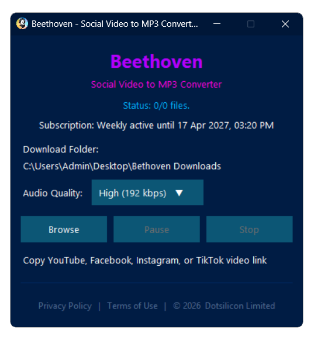

# Beethoven - YouTube to MP3 Downloader

Beethoven is a fast, clean, and easy-to-use Windows application designed to download and convert YouTube videos into MP3 format with minimal effort.

---

## 🔗 Download

👉 [Download Beethoven](https://github.com/dotsilicon/beethoven/releases)

---

## ✨ Features

- 🎧 Convert YouTube videos to MP3 quickly
- ⚡ Fast and lightweight performance
- 🎯 Simple and clean user interface
- 📋 Clipboard auto-detect for YouTube links
- ⏯️ Pause / Resume / Stop controls
- 📁 Playlist support (auto folder creation)
- 🎚️ Selectable audio quality
- 🌙 Modern dark-themed UI

---

## 🖥️ System Requirements

- Windows 10 / 11 (64-bit recommended)
- Internet connection
- Minimum 4GB RAM

---

## 📦 Installation

1. Download the installer from the link above
2. Run `Beethoven.v1.0.exe`
3. Follow the installation wizard
4. Launch Beethoven from the Start Menu or Desktop

---

## 🚀 How to Use

1. Open Beethoven
2. Copy a YouTube video link
3. The app will automatically detect the link
4. Select your preferred audio quality
5. Click **Download**
6. Your MP3 will be saved to your selected folder

---

## 📸 Screenshot
>
> 

---

## 📄 Legal

Beethoven is intended for personal use only.

Downloading copyrighted content without permission may violate applicable laws.  
Users are responsible for how they use this software.

---

## 🛡️ Privacy Policy & Terms

Inside the application:
- Privacy Policy
- Terms of Use

---

## 👨‍💻 Developed By

**Rashidul Hasan**  
Dotsilicon Limited

---

## 🌐 Website

https://dotsilicon.com/apps/beethoven/

---

## 📢 Version

**v1.0**

---

## 📌 Notes

- This application is distributed as a compiled Windows installer.
- Source code is not included in this repository.
- Updates will be released via GitHub Releases.

---

© 2026 Dotsilicon Limited, All rights reserved.
